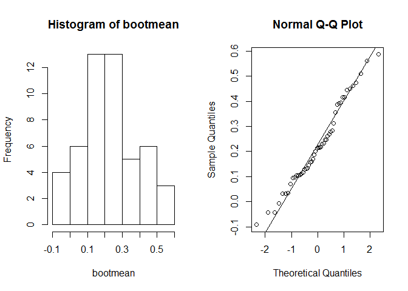
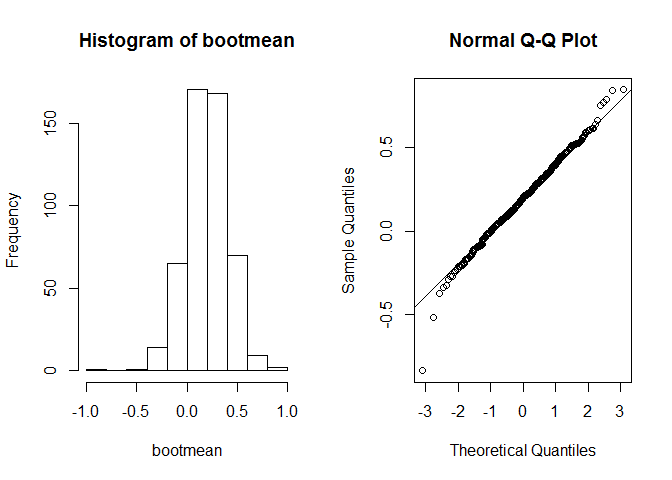
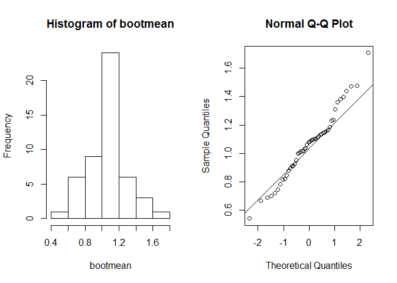

# HW4
Misael Santana  
October 23, 2016  


## HW4  MSDS 6306 DOING DATA SCIENCE - 404
 

Write bootstrap code to illustrate the central limit theorem in R markdown and push the result to GitHub. Use a normal distribution with two different sample sizes and an exponential distribution with two different sample sizes. Correct code alone is insufficient. Please also comment on the code and explain the results. For help, see the lotsa.medians function in Unit 4. The deliverable is a link to a GitHub repo containing the code.

# Creating a Function "bootstrap"

This function has two arguments:
  R: number of Bootstrap Sampling with Replacement
  x: is the data set (vector)


```r
Nbootstrap <- function(R , x){
  bootmean <- numeric(R)
  mean(x) # mean of the original sample
  for (i in 1:R) { #loop to extract the bootstrap sample "bootsample" 
    bootsample <- sample(x, size=length(x), replace=TRUE)
    bootmean[i] <- mean(bootsample) # calculates the mean of the bootsample and save it in the vector bootmean
    }
  # bootmean
  #sd(bootmean)
  par(mfrow = c(1,2))
  hist(bootmean) #plot the histogram
  qqnorm(bootmean)#plot the qq norm graph
  qqline(bootmean)  
}
```

### Normal Distribution With Two Different Sample Sizes

Histogram and Normal Q-Q plot of 50 boostrap samples, population of 20 elements.
 

```r
set.seed(1)
xn<-c(rnorm(20))
Nbootstrap(50,xn)
```

<!-- -->

Histogram and Normal Q-Q plot of 500 boostrap samples, population of 20 elements.
 

```r
set.seed(1)
xn<-c(rnorm(20))
Nbootstrap(500,xn)
```

<!-- -->

### Exponential Distribution With Two Different Sample Sizes

Histogram and Normal Q-Q plot of 50 boostrap samples, population of 20 elements.
 

```r
set.seed(1)
xn<-c(rexp(20))
Nbootstrap(50,xn)
```

<!-- -->


Histogram and Normal Q-Q plot of 500 boostrap samples, population of 20 elements.
 

```r
set.seed(1)
xn<-c(rnorm(20))
Nbootstrap(500,xn)
```

<!-- -->


